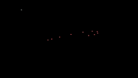

# 🌀 CleanChase

CleanChase is a smooth, minimal JavaScript animation that simulates a chain of circles following a randomly moving target across the canvas.
Each circle “chases” the one before it, creating a fluid, organic motion trail.

You can view the live demo here:
👉 [Clean Chase](https://klabruben3.github.io/clean-chase/)

## 🧠 Features

Smooth, recursive “chasing” animation using requestAnimationFrame()

Dynamic resizing with preserved circle ratios

Fully customizable circle properties (count, color, radius, speed)

Randomized motion paths for endless variety

Works instantly in any modern browser (no frameworks needed)

## 📀 Screenshot / GIF



## 🚧 Experimental: Easing Modes

I’m working on adding custom motion easing — allowing each chase step to follow different easing curves such as sine or cosine instead of simple linear interpolation.

### The idea:

- The speed factor (normally between 0 and 1) is treated like a trigonometric output.

- By mapping the distance to a sine/cosine angle, the speed becomes dynamic — increasing and decreasing smoothly.

- The challenge is normalizing the angle per frame since both distance and target position change continuously.

- This feature would allow circles to follow smoother, wave-like motions instead of fixed-speed chases — basically giving life and rhythm to the motion.

## 🎬 Demo

You can also try it locally:

```bash
git clone https://github.com/<your-username>/cleanchase.git
cd cleanchase
```

open index.html

Or simply open it via GitHub Pages once published.

## 🎨 Customization

All parameters are editable directly in the script:

```const circleCount = 10;     // Number of circles
const circleRad = 4;        // Radius
const speed = 0.03;         // Speed (0–1 range)
const restartDistance = 10; // Distance before creating a new target
const fillColor = "white";  // Fill color
const strokeColor = "red";  // Outline color
```

You can experiment with different values or even randomize them at runtime.

## 💡 Future Additions

- Easing curves (sine, cosine, exponential, custom functions)

- Trail/glow rendering for smoother effects

- User interactivity (mouse or touch-following mode)

- Gradient and blur-based backgrounds

### 🧱 Folder Structure

```
cleanchase/
├── index.html
├── script.js
└── README.md
```

When hosted on GitHub Pages, it’ll automatically run from index.html.
