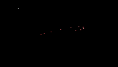

# CleanChase

**CleanChase is a lightweight JavaScript canvas experiment that creates a fluid chain of circles chasing one another across the screen.**

Each circle follows the position of the circle ahead of it, while the first circle moves toward a randomly generated target.

The result is a simple procedural motion system that produces continuously changing, organic-looking trails without relying on an animation framework.

**Live demo:** [CleanChase](https://klabruben3.github.io/clean-chase/)

---

## Demo



---

## The Idea

CleanChase is built around a very small rule:

> **Every point moves toward the point in front of it.**

The first circle follows a target.

Every other circle follows the previous circle.

```text
Random Target
     ↓
Circle 1
     ↓
Circle 2
     ↓
Circle 3
     ↓
Circle 4
     ↓
    ...
```

Because each circle is slightly behind the previous one, the chain naturally produces a trailing motion.

The target periodically changes position, so the movement never follows exactly the same path.

---

## Motion Model

The core movement is interpolation between two positions.

For a circle at:

```js
currentX
currentY
```

following a target at:

```js
targetX
targetY
```

the next position can be calculated using:

```js
x += (targetX - x) * speed;
y += (targetY - y) * speed;
```

The `speed` value determines how much of the remaining distance is covered on each frame.

For example:

```js
const speed = 0.03;
```

means the circle moves approximately 3% of the remaining distance toward its target during each update.

Because the distance continually decreases, the motion naturally slows as the circle approaches the target.

---

## The Chase

The first circle follows the randomly generated destination.

After that, the same rule is applied recursively through the chain:

```text
target
  ↓
circle[0]
  ↓
circle[1]
  ↓
circle[2]
  ↓
circle[3]
```

Conceptually:

```js
circle[0] → target
circle[1] → circle[0]
circle[2] → circle[1]
circle[3] → circle[2]
```

A very small movement rule therefore produces the entire animation.

---

## Random Movement

When the leading circle gets sufficiently close to its target, CleanChase generates another destination.

```text
Generate target
      ↓
Move toward target
      ↓
Distance decreases
      ↓
Threshold reached
      ↓
Generate new target
      ↓
Repeat
```

Because the target coordinates are randomized, the animation continues indefinitely without relying on a predefined path or looping keyframes.

---

## Animation Loop

CleanChase uses the browser's:

```js
requestAnimationFrame()
```

for continuous rendering.

The basic loop is:

```text
Update target
      ↓
Update circle positions
      ↓
Clear canvas
      ↓
Draw circles
      ↓
requestAnimationFrame
      ↓
Repeat
```

This keeps the animation synchronized with the browser's rendering cycle.

No external animation library is required.

---

## Responsive Canvas

The canvas responds to changes in viewport size.

Circle positions are adjusted so resizing the window does not simply discard the existing composition.

This allows the animation to remain usable across different browser dimensions while preserving the general relationship between the circles.

---

## Configuration

The main animation parameters can be changed directly in the script.

For example:

```js
const circleCount = 10;
const circleRad = 4;
const speed = 0.03;
const restartDistance = 10;

const fillColor = "white";
const strokeColor = "red";
```

### `circleCount`

Controls how many circles form the chase chain.

More circles create a longer trail.

### `circleRad`

Controls the radius of each circle.

### `speed`

Controls how aggressively each circle approaches the point ahead of it.

Typical values remain between:

```text
0 → no movement
1 → immediately reach target
```

Smaller values produce smoother, slower trailing behavior.

### `restartDistance`

Determines how close the leading circle must get to its target before a new random destination is created.

### Colors

`fillColor` and `strokeColor` control the visual appearance of the circles.

---

## Easing Experiments

One of the more interesting directions explored by CleanChase is replacing the fixed interpolation factor with a changing easing value.

The current basic motion uses something equivalent to:

```text
position += distance × constant
```

where the interpolation factor remains fixed.

A more expressive model could instead use:

```text
position += distance × easing(progress)
```

with an easing function such as:

```js
Math.sin(...)
Math.cos(...)
```

or another custom curve.

Conceptually:

```text
Linear interpolation

speed
│────────────
│
└────────────── time


Eased interpolation

speed
│       ╭────╮
│     ╭─╯    ╰─╮
│   ╭─╯        ╰─╮
└───────────────── time
```

The harder part is determining meaningful progress when:

* The target is constantly changing
* The remaining distance changes every frame
* Each circle follows another moving object
* Every circle is effectively running its own chase

That makes easing less straightforward than applying a standard animation curve between two fixed positions.

---

## Why This Experiment Exists

CleanChase is deliberately small.

The project is less about building a complete application and more about exploring how surprisingly complex motion can emerge from simple mathematics.

The animation combines:

* Interpolation
* Coordinate systems
* Euclidean distance
* Randomization
* Recursive following
* Frame-based animation
* Responsive canvas rendering

without requiring a framework or animation library.

It is essentially a small study in:

> **How little logic is required to create movement that feels organic?**

---

## Built With

* **JavaScript**
* **HTML Canvas**
* **HTML**
* **CSS**
* **requestAnimationFrame**

No framework or external animation dependency is required.

---

## Running Locally

Clone the repository:

```bash
git clone https://github.com/klabruben3/clean-chase.git
cd clean-chase
```

Then open:

```text
index.html
```

in a modern browser.

Because the project uses plain browser APIs, there is no build step or package installation required.

---

## Project Structure

```text
clean-chase/
│
├── index.html
├── script.js
├── public/
│   └── clean-chase_gif.gif
│
└── README.md
```

The implementation is intentionally small enough to inspect without navigating a framework or larger application architecture.

---

## Ideas for Further Experimentation

CleanChase can be extended in several directions:

* Sine / cosine easing
* Exponential easing
* Spring-like motion
* Variable speed per circle
* Mouse-following mode
* Touch-following mode
* Glow and trail effects
* Gradient rendering
* Blur effects
* Different geometric shapes
* Distance-dependent colors
* Velocity-based styling
* Multiple independent chains
* Collision or repulsion behavior

The project is intentionally open-ended.

---

## Open Source

CleanChase is public and open source.

Feel free to:

* Fork it
* Modify the movement rules
* Reuse the animation
* Experiment with different easing models
* Turn it into a background effect
* Use it as a starting point for other canvas experiments

The implementation is small by design, so it can be taken apart and changed without needing to understand a larger framework.

---

## Final Note

CleanChase started from a simple rule:

> **Move a little closer to whatever is in front of you.**

Repeated across a chain of objects and combined with randomized targets, that rule creates motion that looks considerably more complex than the code responsible for it.

That's the experiment.
